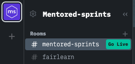
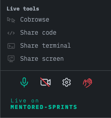

# Technical setup

Welcome Mentored Sprints mentors! We are so grateful to have you all onboard :pray:. We have put together a set of docs to guide and help you prepare for the Mentored Sprints.

!!! info "Getting you ready for mentoring"
    For your convenience, we have created two separate docs:

    1. The technical setup (this doc): goes over the technical details of the infrastructure
    2. Mentoring and preparing yourself and your project for the sprint: [preparing as a mentor](./02-prepare.md) practical advice on how to prepare and what to do to support your mentees

## :mega: Discord server - setup

!!! tip
    We highly recommend you [download the Discord desktop app](https://discord.com/download).

1. Join our Discord Server   
[Join Discord :fontawesome-brands-discord:](https://discord.gg/H4fYmEe){ .md-button .md-button--primary }  
2. Change your name to either your real name or GitHub handle. To help others to identify you, make sure to add mentor or the name of your project for example, `trallard mentor` or `trallard mentored-sprints`
3. Ping anyone in the `@core-team` team so that they can assign you the mentor role
4. Head to `#roles` and `#pronouns`  to self-identify
5. Introduce yourself in `#introductions`

### :sparkles: Important Discord commands

As a mentor you have the ability to invoke a number of commands in Discord. We have crated a handy cheatsheet for you:

Command | Behaviour | Notes
---------|----------|---------
`!help`| display all the available commands in Discord | Should work in all channels but we recommend using in the `#mentors/general` channel
`!coc-report` | Starts a private coc report | This can be invoked by anyone in the `#coc-report` channel
`!bang {username}` | Celebrate someone's accomplishment | We highly encourage you to use this whenever someone achieves something in your team. Please use `#celebrate-wins`

!!!important
    Check [The Mentored Sprints Discord Server Guide](../mentors/03-discord.md) for details on how the server works and rules regarding rooms.

## :video_camera: Sharing your screen and video

### Discord

The voice channels in Discord serve as video and voice. These are great to bring folks working in your project together and onboard them.

We have created one voice channel per project, we have also pinned your project's repo, issue tracker and contributing guidelines so that folks have all those details at hand. You can also add and pin messages that you consider folks might find useful.

!!!info "Server update"
    You can now create temporary voice channels - this might be helpful when mentoring folks 1:1.

#### Creating new temporary channels

1. Scroll down in the left sidebar until you see `TEMPORARY-CHANNELS ⏳`
2. Click on `Hub- Join to create`
3. This will create a new voice channel with your name like so trallard-channel. You can invite up to 6 more people.
4. The channel gets automatically deleted once all the participants leave the channel

You can also invoke any of the following commands for the management of your temporary channel (see image)

### :duck: Duckly

We know pair programming and remote debugging can be challenging. This year we are using Duckly.
Duckly is a video chat and real-time collaboration tool built for teams. It enables distributed teams to talk and work together in a better and more efficient way. With Duckly you can share a web page, your code directly from your IDE, share your terminal, screen and collaborate as if you were side-by-side.

!!!warning "Important"
    You should have received an invite link to join the Duckly team space. Otherwise, [head to this message in the Discord server](https://discord.com/channels/710131475244384358/710131475973931070/842771189814657084)

To get started, follow these steps:

1. Create a Duckly account and select your username: <https://duckly.com/onboarding>

2. Click on the invite link and join the mentored-sprints team

3. Install the relevant plugins based on which IDE you use: <https://duckly.com/faq> or <https://duckly.com/tools>

You can check the getting started with Duckly video here:  <https://youtu.be/YzCPCRTIEPs>

#### Using the Duckly rooms

When you join our team, you will see a left-sidebar similar to the Discord panel. We have created a room per project and additional help tables: **Curie, Lovelace, Hopper, Turing, Ride, Barres and Johnson**.

- **To join a room:** hover over a room name and click on the **Go live** button. 
  
  

- Once you have joined a live channel you can choose your mic, camera, share your terminal and IDE. Head to the bottom left corner of the window and select your tools.

    

- **To leave a room:**Click on the **disconnect** button on the tools panel (red hand icon above).

!!!tip
    Suppose you want to invite a mentee/contributor to a Duckly channel. In that case, you can use the command `!duckly {project}` from Discord.
    For example for `Bokeh` you'd use `!duckly bokeh`. So there is no need for you to share the invite link manually.
    Note you need to write the name exactly as it appears on the Discord channel (i.e. all lowercase and with `-` instead of spaces). This should work on any text channel in Discord.

